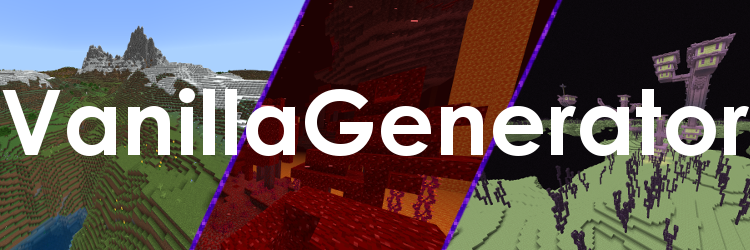

What is this?
------------------------------

This project adds a vanilla generator to the [powernukkitx](https://github.com/PowerNukkitX/PowerNukkitX/) server
software.

⚠️ This plugin only works with powernukkitx for minecraft bedrock edition 1.18.30 (protocol 503) ⚠️

How can I download this plugin?
------------------------------

You can find the downloads on the [releases section](https://github.com/KCodeYT/VanillaGenerator/releases) of this
github
page.
There you can find the LATEST jar file of this plugin.

How can I access the generator?
------------------------------

    0. ⚠️ DO NOT RUN THIS PLUGIN ON A PRODUCTION SERVER ⚠️
             (its not stable and uses much resources)
    1. Add this plugin to your server.
    2. Set the level-type to "vanilla" in your server.properties.
    3. Start your server.
    4. Depending on if you have allow-nether and allow-the_end in your server.properties
       set to true, those worlds will be generated with the vanilla generator at startup.

How does this plugin work?
------------------------------

This plugin works by adding 3 new generators to the server. (vanilla, vanilla_nether, vanilla_the_end)
Those generators start a bedrock dedicated in background server where bots generate chunks continuously and clone them
to the powernukkitx server when they are needed.
As its well known that a bedrock dedicated server uses a lot of resources, with this plugin your server needs those
resources too.
